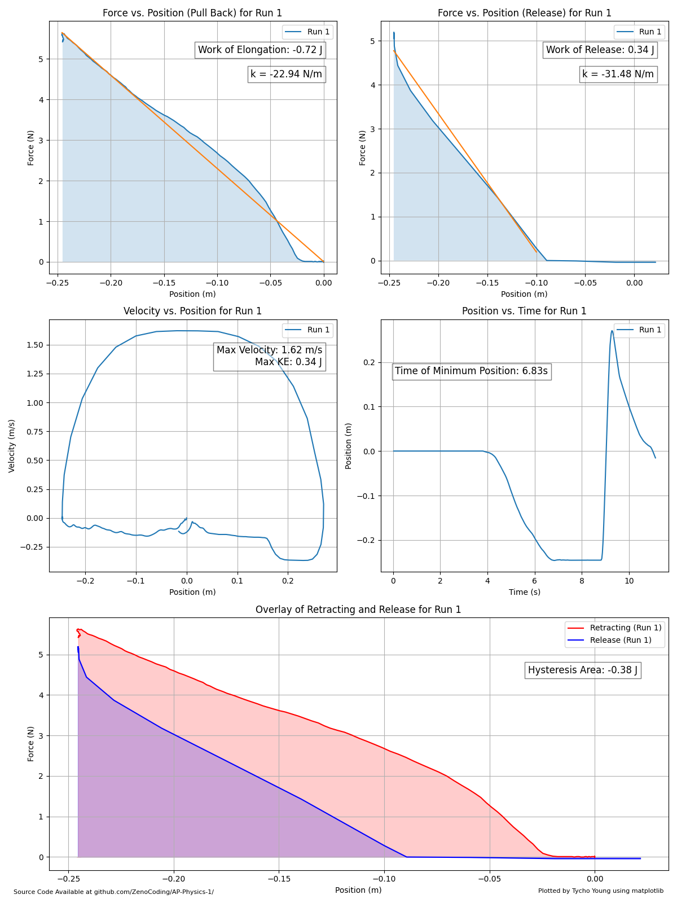
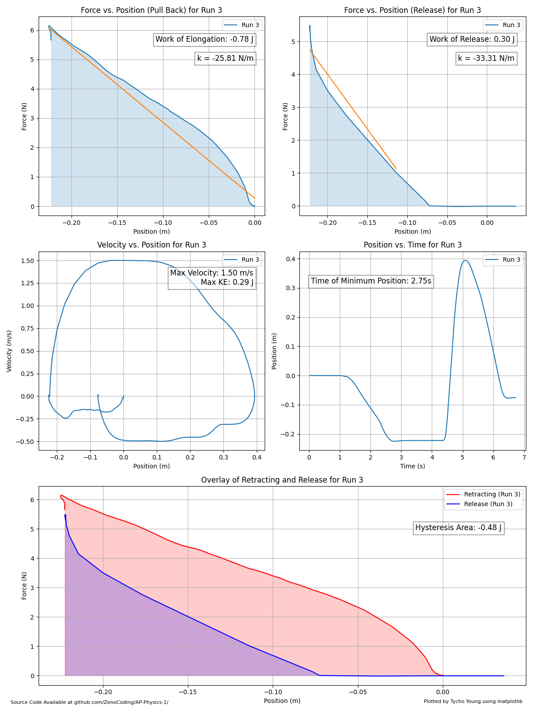

# Work-Energy Theorem and Conservation of Energy
**Tycho Young | AP Physics 1 | Dr. Dixit**


## Abstract
Often, we like to think that some simple physical principles, such as Hooke's law,
are near perfect approximations of the real world, not as susceptible to friction.
However, in reality, this is not the case. In this lab, we explored the energy storage
and transfer of elastic materials, including rubber bands and springs. We explored
friction on the microscopic level, and examined how friction impacts the extension and compression
of various elastic objects, identifying key exceptions to Hooke's law and sources of energy loss.

## Introduction
_The aim of this lab is to identify the relationship between the Work Energy Theorem, The Law Conservation of Energy, and energy losses in a spring system._

### Equipment

| Item Name             | Purpose                                                                                                                                                                                                      | Amount |
|-----------------------|--------------------------------------------------------------------------------------------------------------------------------------------------------------------------------------------------------------|--------|
| PASCO Smart Cart      | The low-friction cart assists with reading position, velocity, acceleration and force values from the built-in encoder and force sensor.                                                                     | 1      |
| Laptop                | Used to run LabVue software                                                                                                                                                                                  | 1      |
| LabVue Software       | The LabVue software allows for wireless bluetooth connection between the laptop and the Smart Cart. It has features for recording the data, exporting it to .csv, and identifying useful graphical features. | 1      |
| Assorted Rubber Bands | Rubber bands are used as a elastic object that can store energy.                                                                                                                                             | 1-3    |
| Assorted Springs      | Assorted springs are used as a hookean object that can store energy. Use various springs with different spring constants.                                                                                    | 1-3    |
| Python 3.11           | Used for graphical analysis.                                                                                                                                                                                 |        |

<br>

### Diagram
<br><br><br><br><br><br>_<br><br><br><br><br><br><br>

### Procedure

#### Background
Hooke's law is used to generally describe the behavior of a spring when the force-displacement relationship is linear.
Hooke's law is defined as: F<sub>s</sub> = -k∆x<br>
When an elastic object, such as a spring, follows this behavior, said object is said to be **hookean.**
When we extend and compress a spring, we are often observing this hookean behavior. This is known as **elastic deformation**. 
We expect the spring to return to its equilibrium position.
However, if a spring is stretched too far, then it will begin to undergo **plastic deformation**. Plastic deformation permanently changes the shape of the spring or elastic substance, and will not obey Hooke's law.

We can also use Hooke's law to describe spring potential energy. By finding the area under the curve for the force•displacement graph of a spring, that gives us the SPE by W = F•d.
More precisely, the integral of Hooke's law gives us spring potential energy.

U<sub>s</sub> = ∫-kx dx = 1/2k∆x<sup>2</sup>

From this dependence, we can see that this formula does not work if an elastic object starts plastically deforming.

So where does the energy go? The energy loss, like in many other situations, is due to a friction force.
As the object plastically deforms, the energy goes more into heat and less into the work done on the object.


When any object changes shape, there are tiny frictional forces as the particles slide against each other. For springs within their hookean limit, this results in a slight loss in energy.
When said spring goes past its hookean limit, the spring starts permanently changing shape.
<br><br>
This permanent change in shape means that the particles within the spring slide more, and they lose more energy to friction.
As a result, more energy is conserved when a spring is stretched within it's hookean limit compared to when it goes past.

Rubber bands behave slightly differently. Rubber bands do not follow Hooke's law in any regard, and are very easily plastically deformed. For this reason, there is large loss in energy when rubber bands are stretched and released.

#### Procedure
1. Record the mass of the PASCO Smart Cart. Record the mass of the elastic object.
2. Zero the readings of the PASCO Smart Cart, ensuring that force, distance, velocity and time are all zeroed.
3. Begin recording. While holding the free end of the elastic object still, slowly pull the PASCO Smart Cart away from the spring until there is significant spring force.
4. Optionally, you may wish to stop recording here to separate your data.
5. If you stopped recording, start recording again. Holding the end of the elastic object still, release the PASCO Smart and allow it to move towards your hand, allowing the cart to attain it's maximum velocity without releasing or moving the elastic object. Stop recording.
6. Repeat steps 2-5 for two more runs to reduce error.
7. Repeat steps 2-6 for all elastic objects.
8. Identify work of elongation, work of release, and max kinetic energy for each run
   1. If you separated your data between elongation and retraction, you may use LabVue to identify graphical features. Please identify the
      1. maximum velocity,
      2. area under the force•distance graph for elongation,
      3. the area under the force•distance graph for retraction,
      4. and the slope of the best fit linear line for the `x=0` side of both force•distance graphs.
   2. Otherwise, export your data to .csv for further analysis. Using python, matplotlib, scipy, and numpy, cleanup the data and perform graphical analysis. `main.py` may be used and adapted for this analysis. For each run:
      1. If data is separated into two runs, then identify `pre_data` and `post_data` by their run numbers. Splice them together and adjust the second run's values.
      2. If data is in one run, we must split it into `pre_data` and `post_data` by the time of the minimum position (the furthest the cart is pulled back).
      3. Plot force•position graph of both pre_data and post_data, making sure to remove any null values. The force is on the y-axis and the position on the x-axis.
      4. Use trapezoidal approximation to find area under each force•distance curve.
      5. Plot the velocity•time graph and identify the max velocity, 
      6. Fit a best-fit line on the head of the data by using a one degree polynomial, and calculate the slope. This is `k`, the spring constant.


<br><br>

#### Steps Taken to Reduce Error
1. Three runs are done for each elastic object.
2. The sensors a set to a high polling rate (40Hz).
3. Data is cleaned and negative values are excluded.

## Data

Mass of Cart: `0.255kg`

| Run Number | Object      | Work of Elongation (J) | Work of Release (J) | Hysteresis (J) | Max Velocity (m/s) | Kinetic Energy (J) | Spring Constant Avg. (N/m) |
|------------|-------------|------------------------|---------------------|----------------|--------------------|--------------------|----------------------------|
| Run 1      | Rubber Band | -0.72                  | 0.34                | -0.38          | 1.62               | 0.34               | 26.85                      |
| Run 2      | Rubber Band | -0.85                  | 0.39                | -0.46          | 1.70               | 0.37               | 25.51                      |
| Run 3      | Rubber Band | -0.78                  | 0.30                | -0.48          | 1.50               | 0.29               | 26.44                      |
| Run 4      | Spring 4    | -0.50                  | 0.45                | -0.05          | 1.78               | 0.40               | 18.805                     |
| Run 5      | Spring 4    | -0.50                  | 0.49                | -0.01          | 1.86               | 0.44               | 19.36                      |
| Run 6      | Spring 4    | -0.67                  | 0.63                | -0.04          | 2.08               | 0.55               | 18.995                     |
| Run 7      | Spring 5    | -2.43                  | 1.81                | -0.63          | 3.24               | 1.34               | 47.19                      |

The `Work of Elongation` and `Work of Release` are found by using scipy.integrate to perform trapezoidal approximation on the force•distance graphs.
The `Hysteresis` is simply the energy loss in elongating and releasing the object, which is attained by summing the trapezoidal approximation of both.
`Kinetic Energy` is found by taking the maximum velocity and applying the formula for kinetic energy, KE = 1/2mv<sup>2</sup>.
<div style="page-break-after: always"></div>

## Analysis
**Run 1** <br>

This is the first run with the rubber band. We can notice that for retracting, the graph doesn't follow a hookean behavior.
The spring exerts very little force at the beginning, and then the force rises at the end.
It is possible this is due to the shape of the rubber band, rather than it's elastic properties.
When the rubber band is first placed onto the cart, it exerts no force.
Since rubber bands start circular, there is a brief period of stretching where the rubber band is merely changing shape, and the actual rubber sides of the band are not stretching linearly.
This gives rubber bands a lot more "give" at first, as you can morph their shape without stretching the rubber material, and explains the starting behavior of the rubber band.
<div style="page-break-after: always"></div>

**Run 2** <br>

This is the second run with the rubber band.
To describe the work done on the rubber band-cart system, we can use the area under the curve, or W = F•d.
As the rubber band is extended, the hand that pulls it back adds energy to the system in the form of spring potential energy.
The energy is stored in the rubber band, but some is lost. When the cart is released, the rubber band exerts a force on the cart, and it accelerates.
The rubber band does work on the cart.

<div style="page-break-after: always"></div>

**Run 3** <br>

<br><br>
This is the third run with the rubber band.
In this run, similar to the last two, there is a large difference in the retraction and the release of the rubber band.
This area difference, known as the hysteresis, is equal to the energy loss of the rubber band.
For the rubber bands, this is a large loss in energy.
Rubber bands do not obey Hooke's law, as there is non-negligible friction between the polymers.
We do notice that there are sections of the curves that seem to be linear, but as found in 
_A study on the stretching behavior of rubber bands_, by Sravya Davuluri and Aruna Ravipati,
rubber bands appear to have some intermediate linear behavior, but cannot be described by Hooke's law because the initial lengths of rubber bands affect elongation.

Normally, the slope of the best fit line would be equal to the spring constant of the object. However, since rubber bands cannot be described by Hooke's law, we may disregard this as a spring constant.
When comparing the two graphs by overlaying them, the release line can be seen to have a large x-intercept that did not exist for the retraction. 
This intercept describes the difference between the initial position of the rubber band and the new equilibrium of the rubber band. 
However, there is something important to note, as we should not attribute all of this to plastic deformation. 
Recall that rubber bands may change shape with very little resistance or force before the rubber material begins to elongate, giving rise to a near-flat portion of the graph in the beginning.
This gives rise to a x-intercept on the graph of the retraction as well.

The sum of the x-intercept of the graph of the retraction and the plastic deformation of the rubber band should be equal to the x-intercept of the release.
However, this doesn't quite make physical sense. Roughly approximating the x-intercept for both curves, the difference is still 0.06m, or 6cm. 
The rubber band didn't elongate 6cm, so what happened?
One hypothesis is that the hand holding the rubber band shifted or moved toward the cart, shortening the distance the rubber band would have to retract to reach it's equilibrium position. 
There were also negative values that arised from continuing to hold the rubber band, which pulled the cart back, and these values had to be removed. 
However, since the cart moves very fast, and the polling rate of the force sensor is only so 40Hz, there are few data points for the release of the cart, potentially leading to missing data that could have moved the line closer to 0.
<div style="page-break-after: always"></div>

**Run 4** <br>

This is the first run with spring #4, a hookean spring with a spring constant of -20 N/m.
The best fit lines fit very well to the graphs, matching the linear behavior described by Hooke's law.
There is a slight hysteresis, caused by the small internal friction present when elastically deforming a spring.
The hysteresis area is negative joules, and is negative because it represents the _loss_ of energy in the system.
There is a slight intercept here as well. In most hysteresis curves, the origin remains at (0, 0), and the graph will return to that point with no intercept.
However, this is not the case here, even though the spring is hookean.
The data cleaning and plotting script uses a two-point linear polynomial approximation to identify the last positive point. 
While this is better than the negative values and noise that would exist otherwise, it is likely not a reflection of the data itself.
Increasing the polling rate of the sensor, or allowing for a quick-release of the spring at the exact correct timing would allow for better data collection, perhaps removing the x-intercept seen here.
<div style="page-break-after: always"></div>

**Run 5**

This run is the second run with spring #4, and is a good example of the error caused to an unsteady hand.
While the graph of elongation conforms to the best-fit line and is hookean, there is much deviation and noise in the force sensor near the top, seemingly randomly.
This likely arises due to the movement in the person holding the spring. 
Eve if the encoders on the wheels are a accurate measure of position, they only measure the change in position of the cart, not the true elongation of the spring.
As a result, if the spring's other end were to move or shift slightly, the elongation of the spring may change, even if the cart did not move.
The other possibility is that the moving of the cart was unsteady, and the wheels were allowed to slip.
Under high spring forces, grip strength and human inconsistencies in movement give rise to variation in the graph. 
Using a spring mount such as a bolt may solve this problem.

The y-intercept in this graph likely arises from poor zeroing of the sensors.
<div style="page-break-after: always"></div>

**Run 6**

Run 6 is a good example of the hysteresis curve for a hookean spring. The spring returns to its original equilibrium position and exerts no force.
<div style="page-break-after: always"></div>

**Run 7**


Run 7 is the only run with spring #5, a hookean spring that has a spring constant of 50 N/m. 
This run gives us valuable information about hysteresis and non-hookean tendencies. 
While the graph appears to not conform to the best-fit line, we can graph a second best-fit line with only the first section of points. This line is dashed and blue.
The first section of points, until -0.2m, appears to be entirely linear!
This is the section of the graph that obeys Hooke's law, and it is within the hookean limit of the spring.
However, past -0.20m, we can see that the graph begins to deviate from the behavior described by Hooke's law, and this is where the energy loss occurs.
In fact, the spring returns to linear behavior past -0.2m on the return, albeit with a lesser spring constant.

#### Work -> KE Conversion
The KE is also not equal to the work done on the cart by the rubber band. This is likely due to loss of energy due to friction, whether that is drag or rotational inertia of the wheels. 
<div style="page-break-after: always"></div>

### Error
Percent error can be found for the spring constants of the springs used.

| Spring # | Given Spring Constant (N/m) | Empirical Spring Constant (N/m) | Avg. Empirical Spring Constant |
|----------|-----------------------------|---------------------------------|--------------------------------|
| 4        | 20                          | 18.805                          | 19.053                         |
| 4        | "                           | 19.36                           |                                |
| 4        | "                           | 18.995                          |                                |
| 5        | 50                          | 47.19                           | 47.19                          |
**Percent Error for Spring 4**
```math
(19.053 - 20) / 20 * 100 = -4.735%
```

**Percent Error for Spring 5**
```math
(47.19 - 50) / 50 * 100 = -5.62%
```

#### Sources of Error
As for the sources of error for the spring constants, the inconsistencies of using humans to hold the springs still is likely the main source of error.

However, many other things gave rise to general inconsistencies and errors in the experiment.

The x-intercept observed in many hysteresis curve could be because of the mounting of the elastic object. Using a bolt would improve this.
Using a winch to pull the cart back would also improve the consistency of the movement of the cart.

A major source of error was the lack of data points. Using 100Hz as a polling frequency would increase the amount of data points and give better area, x-intercept and general data readings.

Holding the elastic object after the cart continued to move obstructed the cart and exerted a negative force on the cart, giving rise to weird artifacts in the data that had to be cleaned, and resulted in the loss of some data points.
Creating a device or practicing timing of the release of the elastic object would allow more accurate data, and the need for a two-point linear approximation at the end would be removed.
<div style="page-break-after: always"></div>

## Conclusion

With hookean springs, the conversion between work done on a spring, spring potential energy, and kinetic energy seems to uphold The Law of Conservation of Energy.
However, friction gives rise to energy loss even with springs, even when we deem it negligible, creating what is known as Hysteresis.
This effect is accentuated when elastic objects are non-hookean or exceed their hookean limit, and energy loss is even greater due to friction caused by plastic deformation of the substance, where more energy is lost as heat.

### My Thoughts
This lab taught me a lot about friction and the conservation of energy. The lab showed me that friction is nearly everywhere in real situations, regardless of whether it's where we expect.
Even though we often write friction off as negligible, it has very real impacts on the principles we assume to be true.
I also learned a lot about Python, matplotlib, and other python libraries when plotting the data for this lab.
This lab is a great lab to demonstrate the basic principles of Conservation of Energy, and even though seemingly simple, it allows for deep analysis of springs and elastic objects if students seek deeper exploration into physics.


## Sources
https://revisezone.com/Html/Physics/Deformation.html

https://emerginginvestigators.org/articles/21-110/pdf#:~:text=Hysteresis%20can%20further%20be%20understood,unloading%20part%20of%20a%20graph.

